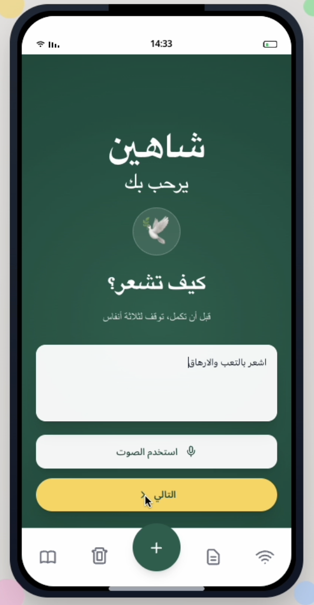
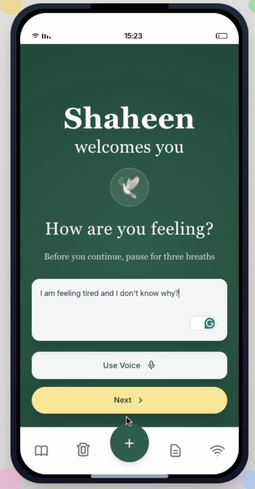

# Shaheen - AI for Emotional Wellness in the MENA Region

Shaheen is an AI-powered emotional wellness companion built for youth in the MENA region. The app transforms a user's feelings into a gentle, expressive comic using local language models and a culturally grounded design. All processing is private, anonymous, and optimized for low-stigma emotional support.

## 🏆 Achievement - 2nd Place Winner

Shaheen won **Second Place** in the **startAD AI for Good Sandbox Hackathon 2025**, supported by Google.org.

- **Nearly 1,000 applicants**
- **~300 accepted**
- **60 teams in competition**
- **Top 15 finalists**
- **Shaheen awarded 2nd place overall**

**Partners included:** National Center for Mental Health Promotion (NCMH – Saudi Arabia), startAD, ZAKA زكا, 42 Abu Dhabi, and Google.org.

## Screenshots

### Arabic Landing Page


### English Landing Page


## Non-Clinical Disclaimer


This application is NOT a clinical tool and does NOT provide medical diagnosis or treatment. It is designed for emotional learning and self-reflection only. For professional mental health support, please consult a qualified healthcare provider.

## Quick Start

### Prerequisites
- Node.js 20+
- Python 3.9+
- Git

### Development Setup

```bash
# Clone the repository
git clone <repository-url>
cd ai4good-nchm-shaheen

# Install dependencies
npm install

# Start development servers
make dev
```

This will start:
- **Web App**: http://localhost:5173 (strict; will not auto-increment if busy)
- **API Server**: http://localhost:8000
- **API Docs**: http://localhost:8000/docs

### Individual Services

```bash
# Web app only
make dev-web

# Web app production preview (same fixed port 5173)
cd apps/web && npm run build && npm run preview

# API only  
make dev-api

# Run tests
make test
```

## Architecture

### Monorepo Structure
```
├── apps/
│   ├── web/          # Vite React PWA (Arabic RTL)
│   └── api/          # FastAPI backend
├── packages/
│   └── shared/       # TypeScript types & utilities
└── docker-compose.yml # Multi-service orchestration
```

### Privacy Model

All user data is stored locally in the browser. No personal information is sent to external servers. Optional anonymous metrics can be enabled by the user.

## Environment Configuration

### Required Environment Variables

Create `.env` file from `.env.example`:

```bash
# API Keys (Optional)
REPLICATE_API_TOKEN=your_replicate_key_here
OPENAI_API_KEY=your_openai_key_here

# Privacy Settings
ALLOW_TELEMETRY=false
DISABLE_EMBEDDINGS=false

# Database
QDRANT_URL=http://localhost:6333
QDRANT_API_KEY=

# App Configuration
APP_NAME=Shaheen
APP_VERSION=1.0.0
DEBUG=false
```

### Environment Flags

| Flag | Default | Description |
|------|---------|-------------|
| `ALLOW_TELEMETRY` | `false` | Enable anonymous usage metrics |
| `DISABLE_EMBEDDINGS` | `false` | Disable corpus retrieval for lightweight environments |
| `REPLICATE_API_TOKEN` | - | Enable AI art generation |
| `OPENAI_API_KEY` | - | Enable advanced AI features |

## Privacy & Security

### Data Handling
- **Local-First**: All user data stored in browser (IndexedDB)
- **No Text Collection**: User inputs never sent to external servers
- **Anonymous Metrics**: Optional telemetry with no personal data
- **Offline Capable**: Full functionality without internet connection

### Privacy Features
- **Data Saver Mode**: Reduces network usage and image loading
- **Opt-in Telemetry**: User controls data sharing
- **Local Processing**: Emotion classification happens client-side
- **Secure Storage**: Encrypted local database

## Internationalization

### Arabic Support
- **RTL Layout**: Right-to-left text direction
- **Arabic Fonts**: Optimized typography for Arabic text
- **Cultural Sensitivity**: Content designed for Arabic-speaking users
- **Localized UI**: All interface elements in Arabic
- **Language Switching**: Toggle between Arabic and English

## Deployment

### Production Build
```bash
# Build web app
npm run build:web

# Build API
npm run build:api

# Docker deployment
docker-compose up -d
```

## API Documentation

### Core Endpoints
- `POST /api/v1/narrative` - Generate therapeutic narratives
- `POST /api/v1/metrics` - Collect anonymous metrics
- `GET /api/v1/health` - Health check
- `GET /api/v1/corpus/stats` - Corpus statistics
- **API Documentation**: http://localhost:8000/docs

## Contributing

Contributions are welcome! Please fork the repository and submit a pull request.

### Code Standards
- **TypeScript**: Strict mode enabled
- **ESLint**: JavaScript/TypeScript linting
- **Prettier**: Code formatting
- **Accessibility**: ARIA labels and roles
- **Mobile-First**: Responsive design

## License

MIT License - See [LICENSE](LICENSE) file for details.

## Clinical Disclaimer

**This application is NOT a clinical tool** and does NOT provide medical diagnosis or treatment. It is designed for emotional learning and self-reflection only. For professional mental health support, please consult a qualified healthcare provider.

---

**Built with ❤️ for the Arabic-speaking community**

*This application prioritizes user privacy, cultural sensitivity, and accessibility while providing valuable emotional learning tools.*
