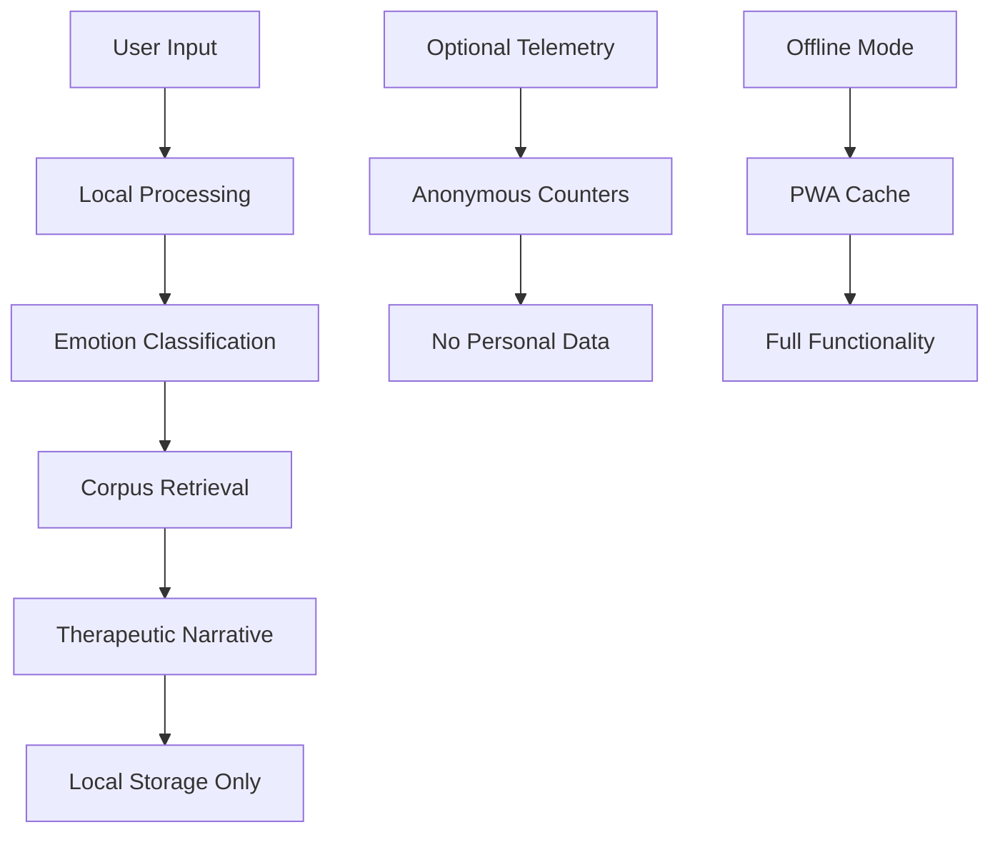

# Shaheen - Arabic Emotional Learning Companion

A privacy-first, non-clinical Arabic emotional learning application that helps users explore their feelings through therapeutic narratives, breathing exercises, and journaling.

## Overview

This application provides a safe, culturally-sensitive platform for Arabic speakers to explore their emotions through therapeutic narratives, breathing exercises, and journaling. Built with privacy-by-design principles and offline-first architecture.

## Non-Clinical Disclaimer

**غير سريري — أداة للتعلم العاطفي فقط**

This application is NOT a clinical tool and does NOT provide medical diagnosis or treatment. It is designed for emotional learning and self-reflection only. For professional mental health support, please consult a qualified healthcare provider.

## Quick Start

### Prerequisites
- Node.js 20+
- Python 3.9+
- Git

### Development Setup

```bash
# Clone the repository
git clone <repository-url>
cd ai4good-nchm-shaheen

# Install dependencies
npm install

# Start development servers
make dev
```

This will start:
- **Web App**: http://localhost:5173 (strict; will not auto-increment if busy)
- **API Server**: http://localhost:8000
- **API Docs**: http://localhost:8000/docs

### Individual Services

```bash
# Web app only
make dev-web

# Web app production preview (same fixed port 5173)
cd apps/web && npm run build && npm run preview

# API only  
make dev-api

# Run tests
make test
```

## Architecture

### Monorepo Structure
```
├── apps/
│   ├── web/          # Vite React PWA (Arabic RTL)
│   └── api/          # FastAPI backend
├── packages/
│   └── shared/       # TypeScript types & utilities
├── .devcontainer/     # Development environment
├── docker-compose.yml # Multi-service orchestration
└── Makefile          # Development commands
```

### Privacy Model



## Environment Configuration

### Required Environment Variables

Create `.env` file from `.env.example`:

```bash
# API Keys (Optional)
REPLICATE_API_TOKEN=your_replicate_key_here
OPENAI_API_KEY=your_openai_key_here

# Privacy Settings
ALLOW_TELEMETRY=false
DISABLE_EMBEDDINGS=false

# Database
QDRANT_URL=http://localhost:6333
QDRANT_API_KEY=

# App Configuration
APP_NAME=Shaheen
APP_VERSION=1.0.0
DEBUG=false
```

### Environment Flags

| Flag | Default | Description |
|------|---------|-------------|
| `ALLOW_TELEMETRY` | `false` | Enable anonymous usage metrics |
| `DISABLE_EMBEDDINGS` | `false` | Disable corpus retrieval for lightweight environments |
| `REPLICATE_API_TOKEN` | - | Enable AI art generation |
| `OPENAI_API_KEY` | - | Enable advanced AI features |

## Demo Mode

For judges and evaluators, a demo mode is available in development:

1. **Start the application** in development mode
2. **Click "وضع العرض"** button (top-left)
3. **Watch the automated journey**:
   - Arabic mood input: "أشعر بالتوتر قبل الامتحان"
   - Emotion classification to Therapeutic narrative
   - Story display with Arabic metaphors
   - Task completion (breathing exercise)
   - Feather earning with particle animation
   - Impact dashboard with statistics

## Privacy & Security

### Data Handling
- **Local-First**: All user data stored in browser (IndexedDB)
- **No Text Collection**: User inputs never sent to external servers
- **Anonymous Metrics**: Optional telemetry with no personal data
- **Offline Capable**: Full functionality without internet connection

### Privacy Features
- **Data Saver Mode**: Reduces network usage and image loading
- **Opt-in Telemetry**: User controls data sharing
- **Local Processing**: Emotion classification happens client-side
- **Secure Storage**: Encrypted local database

## Internationalization

### Arabic Support
- **RTL Layout**: Right-to-left text direction
- **Arabic Fonts**: Optimized typography for Arabic text
- **Cultural Sensitivity**: Content designed for Arabic-speaking users
- **Localized UI**: All interface elements in Arabic

### Language Switching
- **Privacy Page**: Language toggle available
- **Fallback Support**: English for international judges
- **Accessibility**: Screen reader compatible

## Testing

### Test Coverage
```bash
# Web app tests
npm run test:web

# API tests  
npm run test:api

# Full test suite
make test
```

### Manual Testing
- **Offline Mode**: Disconnect internet, test PWA functionality
- **Mobile Responsive**: Test on various screen sizes
- **Accessibility**: Screen reader and keyboard navigation
- **Privacy**: Verify no data leaks to external services

## Deployment

### Production Build
```bash
# Build web app
npm run build:web

# Build API
npm run build:api

# Docker deployment
docker-compose up -d

# Access web at: http://localhost:5173 (fixed via Vite strictPort & compose mapping)
```

### Environment-Specific Configs
- **Development**: Full features, debug mode
- **Staging**: Production-like with test data
- **Production**: Optimized, telemetry enabled

## Metrics & Analytics

### Anonymous Metrics (Opt-in)
- Session starts
- Task completions
- Feature usage
- Performance data


## Development

### Code Quality
- **ESLint**: JavaScript/TypeScript linting
- **Prettier**: Code formatting
- **Ruff**: Python linting
- **TypeScript**: Type safety

### Git Workflow
- **Feature Branches**: Isolated development
- **Pull Requests**: Code review required
- **CI/CD**: Automated testing and deployment

## API Documentation

### Core Endpoints
- `POST /api/v1/narrative` - Generate therapeutic narratives
- `POST /api/v1/metrics` - Collect anonymous metrics
- `GET /api/v1/health` - Health check
- `GET /api/v1/corpus/stats` - Corpus statistics

### Authentication
- **None Required**: Privacy-first design
- **Rate Limiting**: Prevents abuse
- **CORS**: Configured for web app

## Contributing

### Development Setup
1. Fork the repository
2. Create feature branch
3. Make changes with tests
4. Submit pull request

### Code Standards
- **Arabic Comments**: For Arabic-specific code
- **TypeScript**: Strict mode enabled
- **Accessibility**: ARIA labels and roles
- **Mobile-First**: Responsive design

## License

MIT License - See [LICENSE](LICENSE) file for details.

## Support

### Technical Issues
- **GitHub Issues**: Bug reports and feature requests
- **Documentation**: Comprehensive guides and examples
- **Community**: Developer discussions

### Clinical Concerns
- **Not Medical Advice**: This app is not a substitute for professional care
- **Crisis Resources**: Contact local mental health services
- **Professional Help**: Consult qualified healthcare providers

---

**Built with ❤️ for the Arabic-speaking community**

*This application prioritizes user privacy, cultural sensitivity, and accessibility while providing valuable emotional learning tools.*
